# Create Progressive Web App with ease using Vuejs, Cosmic JS, and GraphQL


## TL;DR:
* Vue
* Vuex
* Cosmic JS
* GraphQL
* PWA applications

## Intro
Progressive Web Apps (PWA) combine the look and feel of an app with the ease of programming of a website. These cutting edge apps make it easy for your users to access your content, and engaged users increase your revenue. Rapid Loading is one of it's features. PWA load faster than mobile websites, even with limited internet availability, ensuring your users always have the best experience. These are the main features:

* Access Anywhere
* Direct Deployment
* Promote with SEO
* Always Available (even offline)
* Easy Updates
* Safe and Secure

One of the best parts of PWA is they are quick to build and quick to get to the market without dealing with any phone native code or app store wars.

This application was mainly inspired by Offerup, Letgo, and Craigslist.
Like Craigslist, LetGo allows you to buy and sell items locally, which means you don’t have to deal with the hassles of shipping like you would on eBay or Amazon. With 30 million users, it is more popular than OfferUp. LetGo has been featured in many commercial lately, so you may be more familiar with it as well. The only issue is that both apps are mobile apps available on both iPhone and Android platform, however there no PWA version. So let's sit back and see if we can leverage PWA, Vue.js Cosmic JS and build one.

## Application Overview
The application consist of mainly three major functions:
* Display a list of items for sale in your area. In our case it will be a gallery view if images for all items for sale
* The ability to search for keywords and filter the gallery view to the items matching the search term
* The ability to click an item image and show the item description, seller, more images, contact seller...
* The ability to add new item. This feature I didn't build due to the scope of this project, but this can certainly add a valuable addition.

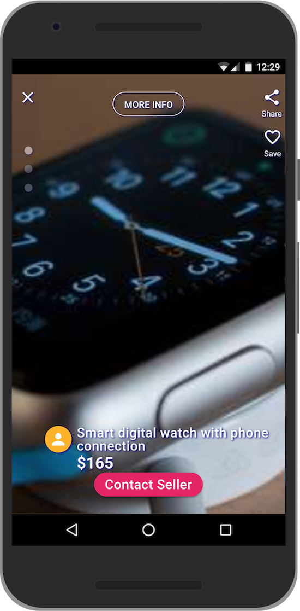

## Starting your Vue PWA app
Let's rollup our sleeves and get building. We'll start by creating the project using vue-cli commands. However if you don't have vue-cli installed, please follow this. So open your terminal window and type the following:

```
vue create garage-sale
# then select Manually...

Vue CLI v3.0.0-rc.9
┌───────────────────────────┐
│  Update available: 3.0.0  │
└───────────────────────────┘
? Please pick a preset:
  default (babel, eslint)
❯ Manually select features

# Then select the PWA feature and the other ones with the spacebar
? Please pick a preset: Manually select features
? Check the features needed for your project:
 ◉ Babel
 ◯ TypeScript
❯◉ Progressive Web App (PWA) Support
 ◉ Router
 ◉ Vuex
 ◯ CSS Pre-processors
 ◉ Linter / Formatter
 ◯ Unit Testing
 ◯ E2E Testing

? Pick a linter / formatter config:
  ESLint with error prevention only
  ESLint + Airbnb config
❯ ESLint + Standard config
  ESLint + Prettier

? Pick additional lint features: (Press <space> to select, <a> to toggle all, <i> to invert selection)
❯◉ Lint on save
 ◯ Lint and fix on commit

🎉  Successfully created project barage-sale.
👉  Get started with the following commands:

 $ cd barage-sale
 $ npm run serve

```

So far, this step looks like any regular Vue app creation except the PWA selection step. Thanks to vue-cli which is a doing a lot work behind the secenes and add the service worker option which a major feature of PWAs.
So let's continue and add our functions step by step.

We also need to add vuetify which will be our css framework. Before using vuetify, I used Bootstrap for most of my projects, however after trying Vuetify, I was hooked since. Vuetify in my opinon offers two majore advantages:
* Rapid development, comparing to bootstrap
* Easy integration with Vue js

So let's add it to out project

```
vue add vue-cli-plugin-plugin
? Use a pre-made template? (will replace App.vue and HelloWorld.vue) Yes
? Use custom theme? No
? Use a-la-carte components? Yes
? Use babel/polyfill? Yes
✔  Successfully invoked generator for plugin: vue-cli-plugin-vuetify
```

Also notice, that I picked the `use-a-carte` option when adding Vuetify because I want to customize one of it's components, and also I don't want to import all components from Vuetify. This will keep the files smaller comparing to importing all Vutify library.

## Add the app components, router, and store

Since the application will act as a SPA (single page app) we need to add the router. For the purpose of our application we only need two routes:
* Home: where we display the posts grid view and the search toolbar
* Post: this is the item detail view where we can see the item details info

So let's open the terminal window, and add the following files:

```
# adding the vue components
touch src/views/Home.vue
touch src/components/PostGrid.vue
touch src/components/PostItem.vue
touch src/components/PostDetails.vue
touch src/components/PostCarousel.vue

# add router, store,
touch src/router/index.js
touch src/store/index.js
```

And we add the routes to our application like this:

```
# /garage-sale/src/router/index.js
import Vue from 'vue'
import Router from 'vue-router'
import Home from '@/views/Home.vue'

Vue.use(Router)
export default new Router({
    routes: [
        {
            path: '/',
            name: 'home',
            component: Home
        },
        {
            path: '/post/:postIndex?',
            name: 'post',
            component: () => import('@/components/PostDetails.vue'),
            props: true
        }
    ],
    mode: 'history'
})
```

Note that the router we didn't import the `PostDetails.vue` component at the begining. This is lazy loading, which means that our app would not load this component at the start to make it faster and only load this component once the user needs it.
And let's edit the main.js and the App.vue as the following:

```
# /grarage-sale/main.js
import '@babel/polyfill'
import Vue from 'vue'
import './plugins/vuetify'
import App from './App.vue'
import router from './router'
import store from './store'
import './registerServiceWorker'

Vue.config.productionTip = false
new Vue({
    router,
    store,
    render: h => h(App),
    created () {
        this.$store.dispatch('loadInitialData', {term: ''})
    }
}).$mount('#app')
```

```
# /garage-sale/App.vue
<template>
    <v-app id="app">
        <router-view></router-view>
    </v-app>
</template>
```

Note that in order to use Vuetify we don't say `import Vuetify from 'vuetify'` we import from `/plugins/vuetify` because we only need to select which components we are using. Take a look at [src/plugins/vuetify.js](https://github.com/mtermoul/garage-sale/blob/master/src/plugins/vuetify.js) and see how it's done.

## Adding the UI code
So let's start by creating our UI as we see below.

```
# /garage-sale/src/views/Home.vue
<template>
    <v-app id="home">
        <v-navigation-drawer app>
        ...
        </v-navigation-drawer>
        <v-toolbar>
        ...
        </v-toolbar>
        <v-content>
            <v-container fluid xfill-height>
                <v-layout row wrap>
                    <v-flex xs12>
                        <post-grid :posts="posts"></post-grid>
                    </v-flex>
                </v-layout>
            </v-container>
        </v-content>
    </v-app>
</template>
```
So far in our home page we just added a top toolbar with a search text field, search button, and left navigation menu. in page content area we just added a component `post-grid` which will serve as a place holder for our data.

Before moving any further we need some data to test and build our UI components. So without further due, lets do that in the next chapter.

## Building the backend with Cosmic JS
Before discovering Cosmic JS, I use to use either plain JSON files and write a little Node.js application that have a bunch of Rest API endpoints. Another alternative is using some cloud noSQL database to host the JSON data documents and write a server Rest API to serve that data. However all that is gone, after learining that with Cosmic JS, you no longer have to write server side API. Just design your data, insert or import from JSON files, and the Cosmic JS will generate the Rest API automatically for you. As a metter affect Cosmic JS, offers two kind of API end points:
* Rest API which will be CRUD methods for adding, displaying, and updating your data.
* GraphQL API, which is also similar to Rest, but you can write your queries using special Syntax called GraphQL. If your no familliar with GraphQL, I encourage you to review the documents. It's has been gaining a lot momentum lately due to it's flexibilites and popularity. Plus it was developed by Facebook.
For my application I will include both Rest, and GraphQL methods to let you experiment and decide which one works best for you. If you are not using Cosmic JS, then you have to write your own server GraphQL API using some database as a storage mechanism, and Node.js for the GraphQL endpoints.

OK, let's jump in to Cosmic JS and add our data elements. aftrer you sign up for free account, open the dashboard and add new bucket called `garage-sale`.

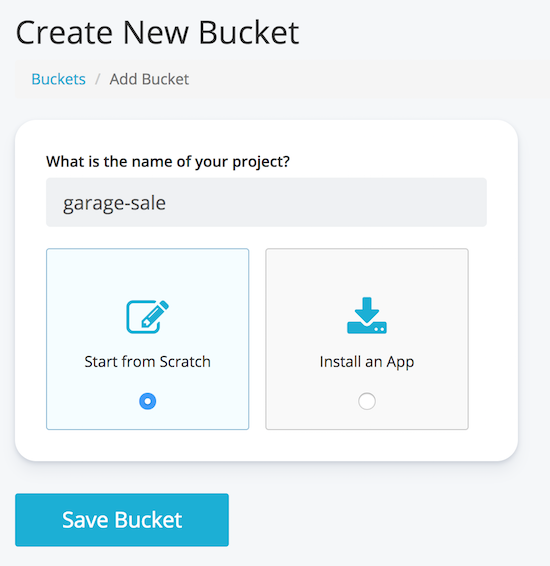

After that open the dashboard for this bucket and from the left side menu, add the following `Object Type`:

* Posts
* Users
* Locations
* PostConditions
* PostCategories

Object Type is the equivilant of a database table, if you're coming from an RDBMS database. After adding each Object Type, you can start definig the `metafield` for each object type. A metafield is the equivilant of schema, or table columns. So let's see this process below:

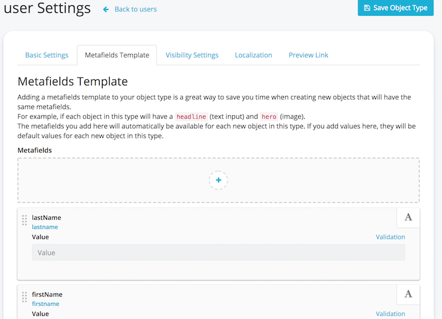

So add the following fields to each object type:
```
# Locations
city: text
state: text
country: text
postalCode: text

# Users
email: text
firstName: text
lastName: text

# Posts
title: text
description: text
condition: PostCondition
price: text
isFree: boolean
categories: [PostCategory]
images: [media/file] (files will be uploaded to Cosmic JS files.
mainImage: number
isSold: boolean
dateAdded: date
user: User

# PostConditions
name: text
desc: text

# PostCategories
name: text
```

After adding the `Object Type` and `metafields`, it's time to add some data. For adding data just click on the object type from Cosmic JS dashboard left menu, and start adding data. You can also insert data using Cosmic JS CLI API. Please review the documentation for the CLI functions. I personally used both the dashboard and the CLI to insert the test data for my applcation. Here is an example of how you would add data to the post categories object type:

```
# inserting into PostCategories
cosmic add-object --type_slug "postcategories" --title "Shoes" --metafields [{title: "name", value: "Shoes"}]
cosmic add-object --type_slug "postcategories" --title "Cars" --metafields [{title: "name", value: "Cars"}]
...
```
and in a similar way you can add all of your objects. For the images, it's easier to open the dashboard, and upload all of your images using the `Media` function from the left menu of Cosmic JS dashboard. For my application, each post have multiple images, and each emage has three versions. Extra small, small, and medium which will be selected based on the screnn display size. Since we are developing for PWA which is mainly for mobile devices, we will be mainly serving xm and sm images. However we asre also providing an alternate view for a desktop using the md files just in case if the app is opened from the desktop screen. We will get into more details about how to optimize images for our PWA app further down.

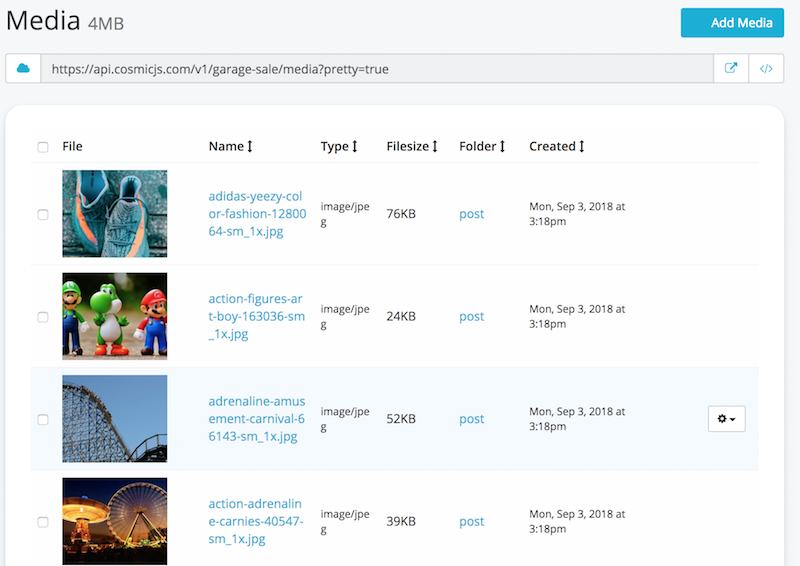

And we are done from the back-end side. In the next section, we will review how to consume our data using Cosmic JS API.

## Consuming the Cosmic JS API via Rest or GraphQL
As mentioend earlier, Cosmic JS offers two ways to perform a CRUD operations via API calls. Firt we can interact with data using plain old API. For the full documentation please review [Cosmic JS Rest API Docs](https://cosmicjs.github.io/rest-api-docs/#introduction)
here are few examples:
```
Cosmic.getObjects({type: 'postcategories', limit: 10})
Cosmic.getObjects({type: 'users', skip: 5, limit: 2})
Cosmic.getObjects({type: 'posts'})
```

We can also interact with Cosmic JS via the GraphQL api. Please read the [Cosmic JS GraphQL API](https://cosmicjs.com/docs/graphql) for the full documentations. If you like to run few queries and test this API open [GraphIql Playground](https://graphql.cosmicjs.com/) and write some GraphQL queries:

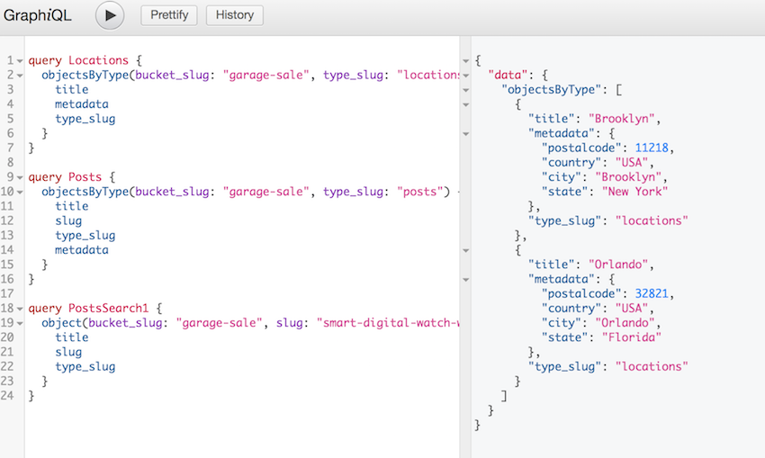


## App state using Vuex, Cosmic JS, and Vue store.
In order to maintain the application state we need to persist data somewhere, and allow all components and modules within our application to share this data. So for this reason we will be using [Vuex](https://vuex.vuejs.org/). So for my app, as mentioned before I have two actions to fetch data from Cosmic JS. The first one `fetchPosts` which will simply call Cosmic JS REST api and retreive all posts. I will not dive into this since a lot of documentations has be written about this. The second method is `fetchPostsGQ` which will fetch post data from Cosmic JS GraphQL API. So let's take a look on how it is done.

```
# /garage-sale/src/store/index.js
import Vue from 'vue'
import Vuex from 'vuex'
import Cosmic from '../api/cosmic' // used for Rest API
import { ApolloClient, HttpLink, InMemoryCache } from 'apollo-boost' // used for GraphQL API
import gql from 'graphql-tag'

const client = new ApolloClient({
    link: new HttpLink({uri: 'https://graphql.cosmicjs.com/v1'}),
    cache: new InMemoryCache()
})

Vue.use(Vuex)

export default new Vuex.Store({
    state: {
        isDataReady: false,
        posts: [],
        ...
        searchTerm: ''
    },
    ...
    actions: {
        ...
        loadInitialData ({commit, dispatch}, payload) {
            dispatch('fetchPostsGQ', payload)
            dispatch('fetchPostConditions')
            dispatch('fetchPostCategories')
            commit('SET_USER_LOCATION', {city: 'Orlando', state: 'FL', postalCode: '32821'})
        },
        fetchPostsGQ ({commit, state}, payload) {
            if (state.isDataReady) {
                commit('SET_IS_DATA_READY', false)
            }
            client
                .query({
                    query: gql`query Posts($bucket: String, $type: String!) {
                            objectsByType(bucket_slug: $bucket, type_slug: $type) {
                                _id
                                title
                                slug
                                metadata
                            }
                        }`,
                    variables: {bucket: 'garage-sale', type: 'posts'}
                })
                .then(data => {
                    commit('SET_POSTS', data.data.objectsByType)
                    commit('SET_IS_DATA_READY', true)
                })
                .catch(error => {
                    // eslint-disable-next-line
                    console.log(error)
                })
        }
    }
})
```
So let me go over few point from the store file above. First in order to use GraphQL API from Cosmic JS or any other GraphQL api we need the GraphQL client library. At the time of writing this article there are many js libraries that can be used as a GraphQL client, however I picked [apollo-boost](https://www.npmjs.com/package/apollo-boost) because it has in-memory caching feature. I am also using `graphql-tag` to be able to parse the GraphQL queries written as multi-line string. After that we need to initiate the `ApolloClient` instance, by providing the URL for the GraphQL API. In our case the url provided to us by CosmicJS is `https://graphql.cosmicjs.com/v1`.
After this, we are ready to write our first GraphQL query, and fetch some data. In the function `fetchPostsGQ` we can see the syntax of the GraphQL query as the following:

```
query: gql`query Posts($bucket: String, $type: String!) {
        objectsByType(bucket_slug: $bucket, type_slug: $type) {
            _id
            title
            slug
            metadata
        }
    }`,
variables: {bucket: 'garage-sale', type: 'posts'}
```

The query above would be the equivalent of the following select statement if you are familiar with SQL language.
```
SELECT _id, title, slug, metadata
FROM garage-sale.posts
```
The rest of the code is just required to get the results and populate the `state.posts` variable. I should also mention that we have `state.isDataReady` variable which will be set to `true` as soon as we have data back from the api. Otherwise the UI will show some kind of loading icon. Lastly, I would like to mention all the data needed for our UI, will be selected from `post.metadata` which is just the format of the data returned from Cosmic JS. Please take a look at [store/inex.js](https://github.com/mtermoul/garage-sale/blob/master/src/store/index.js) for the full source code of the Vuex store.

## Loading initial data and populating the home page
When starting the application we will see the data loading spinner for few seconds, then we will see grid loaded with the data from the server.

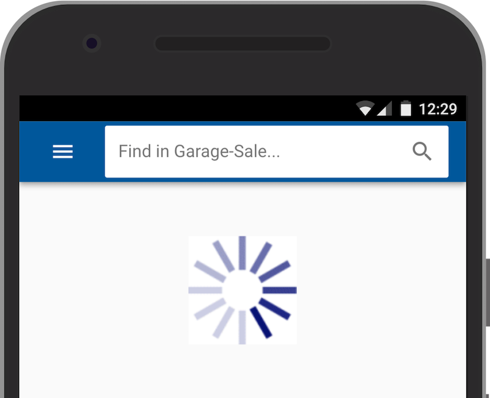

We are able to achieve this by first calling `loadInitialData` from the [main.js](https://github.com/mtermoul/garage-sale/blob/master/src/main.js)

```
# /garage-sale/main.js
import '@babel/polyfill'
import Vue from 'vue'
import './plugins/vuetify'
import App from './App.vue'
import router from './router'
import store from './store'
import './registerServiceWorker'

Vue.config.productionTip = false

new Vue({
    router,
    store,
    render: h => h(App),
    created () {
        this.$store.dispatch('loadInitialData', {term: ''})
    }
}).$mount('#app')
```
As you can see in the code above. To trigger the fetch data we jus call the `loadInitialData` action from the application `created` life hook.

Now let's take a look at the `Home.vue` component and see how we use this data.

```
# /garage-sale/views/Home.vue
<template>
    <v-app id="home">
        <v-navigation-drawer
        ...
        </v-navigation-drawer>
        <v-toolbar
        ...
        </v-toolbar>
        <v-content>
            <v-container fluid xfill-height :class="{'pa-0': $vuetify.breakpoint.smAndDown}">
                <v-layout row wrap>
                    <v-flex xs12>
                        <post-grid :posts="posts"></post-grid>
                    </v-flex>
                </v-layout>
            </v-container>
        </v-content>
    </v-app>
</template>
<script>
import PostGrid from '@/components/PostGrid'
export default {
    ...
    computed: {
        ...
        posts () {
            return this.$store.getters.posts
        }
    },
    components: {
        PostGrid
    },
    ...
}
```
As you can see from the code above, there is a computed property `posts` which will be fetched directly from the Vuex store. And this posts property is passed down as a component prop to the `PostGrid` component. The `PostGrid` component will loop through the array elements and draw the post item on the screen.

In the home page, there is also a search function, which will simply take the search term from the input textbox and call the `fetchPosts` action again with the keyword parameter.

## Displaying the Post details page.
Each item in the `PostGrid` from the home page, will have a link to the `post` page
```
# /garage-sale/src/components/PostItem.vue
<template>
    <v-card :to="{name: 'post', params: {postIndex: postIndex}}" :title="postData.title">
        <v-card-media
            height="200px"
            :src="mainImageUrl">
        </v-card-media>
    </v-card>
</template>
```
And when we click on the `PostItem` the router will take the user to the `PostDetails` page.
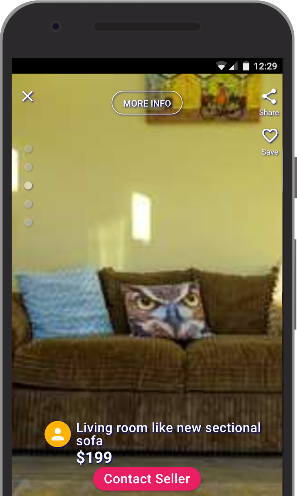
Once we land on this page we have four major function:

* Swipe up: displays the post item previous image
* Swipe down: displays the post item next image
* Swipe left: displays the next post item
* Swipe right: displays the previous post item

Besides the swipe function, that will require a touch screen device, there are other functions like the `Contact Seller` button, and the `More Info` buttons which are straight forward. On the click of each of this buttons we show/hide a section on the view by using Vue js `v-show` and `v-bind` directives.

The last, peice on this puzzle, is the post details carousel which is used to browse through the images of the post item. For this project, I've used Vuetify `Carousel` component to display multiple images, and allow the user to browse through these images by using the swipe up and down actions.
I also included in this project [/src/components/PostCarousel.vue](https://github.com/mtermoul/garage-sale/blob/master/src/components/PostCarousel.vue). This component, is an extention of `vuetify.carousel` with few tweaks. I've added the vertical swipe mode to allow the user to browse through images. Out of the box `vuetify.carousel` will only allow left/right swiping. So if you take a look at the code you will see that this component extends the `VCarousel` component

```
# /garage-sale/src/components/PostCarousel.vue
<script>
import { VCarousel } from 'vuetify'
export default {
    name: 'post-carousel',
    extends: VCarousel,
    props: {
        verticalScrolling: {
            type: Boolean // by default the item scrolls horizontally
        }
    },
...
</script>
```
So, there you have it! this is how you use component inheritence, and extend third party components in it's most basic ways.

## How abou the desktop view?
Even though this app is built mainly for mobile devices, adding just few lines of code will surely make it desktop friendly as well. So as a part Vuetify you can write responsive web apps easily using the grid layout system. For exapmle:

```
<v-flex xs12 sm6 offset-sm3>
...
<v-flex>
```
means that this `div` will take the full width of the page if this is `xm` which means extra small device. and it will take half of the width for small size screen or larger. Knowing that each screen has about 12 columns in total. There is also another feature of Vuetify that will allow us to query screen size and issue conditional statements or apply conditional styling. It's called `breakpoint` and can be used as the following:

```
# only apply the css class if size is medium and up
<div :class="{'view-medium-and-up': $vuetify.breakpoint.mdAndUp}">

# image size will be calculated based if screen size is small and down
const imgSize = this.$vuetify.breakpoint.smAndDown ? '200px' : '400px'
```

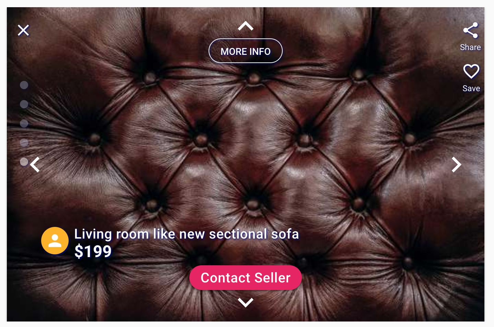

As you can see, the post details page on the desktop is only taking half width. I also included navigarion arrows (left, right, top, bottom) since there is no swipe capabilities on the desktop version. All of that logic, can implementing with Vuetify and Vue fairly easily.

One more thing is worth mentioning is that the post images resulotion will change based on screen size. So for each image there are three resolutions xm, sm, and md. And there is logic to show the appropriate image based on the screen size. Let's see ho did we acheive that.

First all post images need to be optimized for PWA, and produce three files for each image. For instace if a post has an image named `adidas-yeezy-color-fashion-1280064.jpg` then we will need to produce three version of this image as below:

* adidas-yeezy-color-fashion-1280064-xs_1x.jpg
* adidas-yeezy-color-fashion-1280064-sm_1x.jpg
* adidas-yeezy-color-fashion-1280064-md_1x.jpg

There are many ways, applications, tools and websites that you can use to optimize images and automate the process. In the next section, I will explain more about this process and PWA optimization. However in this section, I just wated to show you how to conditionally change the UI, and display different images based on screen size

```
    postImages () {
        const imgSize = this.$vuetify.breakpoint.smAndDown ? '-xm_1x' : '-sm_1x'
        ...
    },
```

The code above is simply selecting the right image file name based on the screen size.

## Time to run the app and test it.
I think at this point we our application is ready for some testing. To check and see how the app is behaving on a mobile device, I strongly recommand using Chrome dev tool. And from there, you can use the device toolbar to change device screen size. You can also see how the app will behave with a touch screen capability. I beleive Safari has a similar feature, called `Enter Responsive Design Mode` under the development menu.
Another useful feature that allow me to test how actual phone feels, was the xCode device simulator. I used this function, when I was troubleshooting some iPhone specific issues, and it came really handy. I beileve that xCode can be installed easily on a mac, however I am not sure about PCs! But I think that Windows OS should have similar apps or other device simulators.

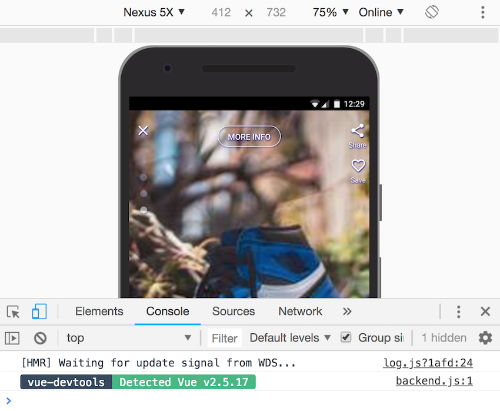

I also, recommend using vue-dev-tools addon for Chrome. It will save you a lot of time debugging and seeing what's going on under the hood.

So to run the application simply run the following vue-cli commands:

```
# run on dev mode
npm run serve

# build you app for production
npm run build

# serve prod build on your local machine. You need to install serve first (npm install serve)
serve -s dist
```

For this project I am using `http-serve` to serve my PWA app on the server, because it offer many useful features like:

* https capabilities
* gzip files serving

You can also write your own node/express server if you like to have control, but for me this was quicker.

## Optimizing PWA application with Google Lighthouse.
After all this work, the moment of the truth came when I ran application audits using Google Lighthouse from Chrome devtools. The first time I ran the audits the score were terrible and below 50%.
This is how it looked at some point, before implementing few suggestions

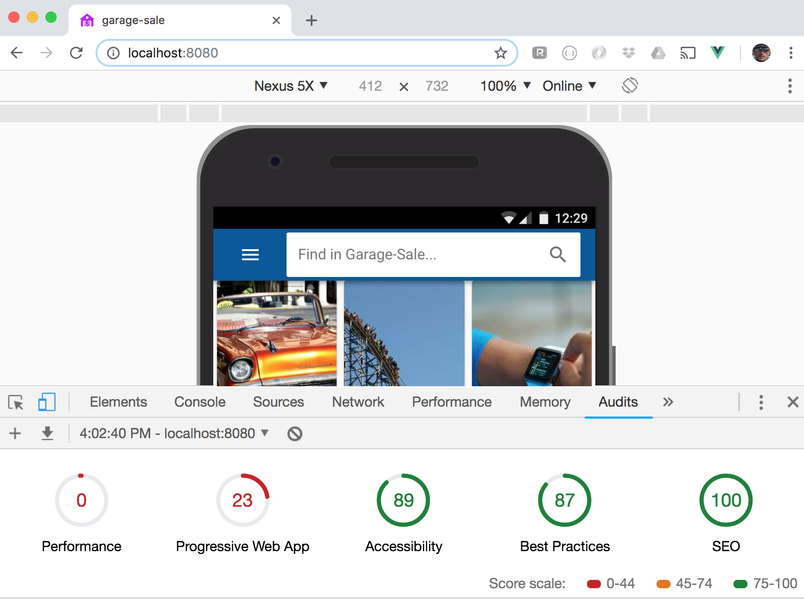

After the first run, I had to go through Lighthouse scores one by one and implement all the suggestion recommended. And each time the scores were getting better and better. I have also gained more insights on how SEO, performance, PWA... are scored and how to make each one of those areas better. After many itarations I had the following score

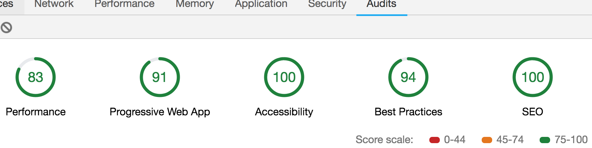
Even though, I didn't score 100% in all categories, I felt much better and learned a lot by just implementing the changes suggested by Google.
Is it possible to score 100% in all categories? you may ask. And the answer is yes, if you willing to spend time and implement all the recommendations.

One major problem that was affecting the site performance, was the images. I realized that the images that I was serving were not mathching the screen size. So after going throuhg some suggestions, I found this article
[A Guide to Responsive Images with Ready-to-Use Templates](https://medium.freecodecamp.org/a-guide-to-responsive-images-with-ready-to-use-templates-c400bd65c433)
Which explains the problem in details and also layout the best solution for you. So after the article above, I created a grunt process that goe through each image under a floder, and produce multiple versions.

I know that I didn't not go through every line of code here, however I strongly recomend for you to try the application [demo](https://www.google.com) and see how it feels. You can also check out the [code](https://github.com/mtermoul/garage-sale) and see if you have any questions.

## Conclusion
Building a PWA application may feels daunting task at first. However with the help of Vue templates, Vuetify, and Cosmic JS, the task felt more enjoyable, and I learned few more tricks at the end. So my conclusion, is that you may not know all the answers before your journey, however as long as you have the ability to ask those questions, and try new things, you will learn, and grow in your way to building great things.

Thanks for taking the time to read my story, and I hope that I have inspired you to build you next PWA idea.
